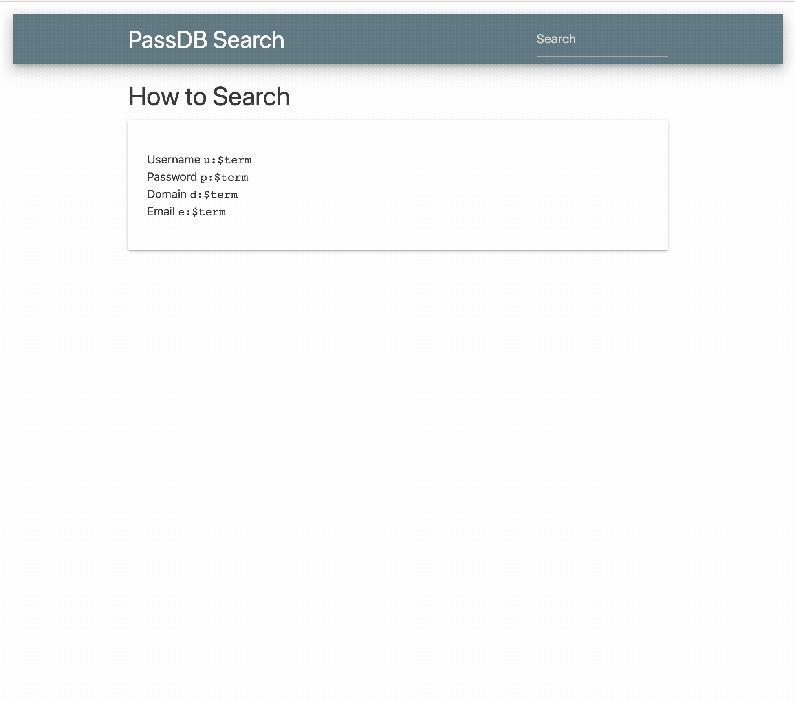

# passdb-frontend

Connects with the [passdb-backend](https://github.com/audibleblink/passdb-backend) which serves an API for searching through a self-seeded password dump
database. Users of the app are able to search by `username`, `password`, `domain`, or `email`. From
the results page, users may pivot around on any clickble piece of information.

This is a fully decoupled frontend single-page app which creates API calls to `http://localhost:4567`



## Get started

Install the dependencies...

```bash
cd passdb-frontend
npm install
```

...then start [Rollup](https://rollupjs.org):

```bash
npm run dev
```

Navigate to [localhost:5000](http://localhost:5000). You should see the query interface.
