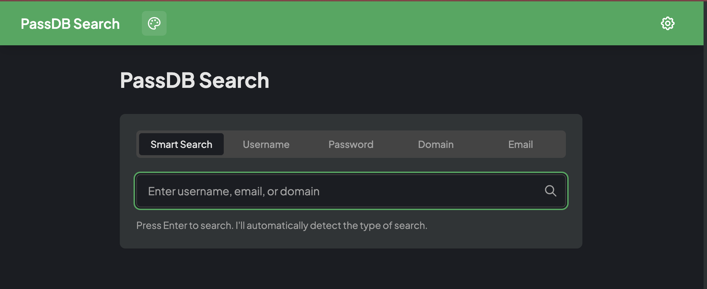

# passdb-frontend

A modern Svelte 5.x web interface for searching password dump data via the passdb-backend API.



## Features

- **Multi-search Support**: Search by email, username, password, or hash
- **Dark Mode**: Seamless theme switching with system preference detection
- **Responsive Design**: Optimized for both mobile and desktop
- **Keybinds**: Full keyboard navigation
- **Themes**: Multi-theme switcher 
- **HIBP Integration**: Enhanced Have I Been Pwned data for email searches

## Tech Stack

- **Frontend**: Svelte 5.x with TypeScript
- **Build System**: Vite with HMR
- **Styling**: Tailwind CSS 4.x with CSS variables
- **Components**: shadcn-svelte for accessible UI components
- **Testing**: Vitest with coverage reporting
- **Deployment**: Static site generation to `docs/` directory

## Prerequisites

- Node.js (version 18+)
- passdb-backend API running at `http://localhost:3000`

## Quick Start

```bash
# Install dependencies
npm install

# Start development server
npm run dev

# Open http://localhost:5000
```

## Development Commands

### Core Development
```bash
npm run dev          # Start Vite dev server with HMR
npm run build        # Build for production
npm run preview      # Preview production build
```

### Testing
```bash
npm run test         # Run Vitest tests
npm run test:ui      # Run tests with UI
npm run coverage     # Generate coverage report
```

### Code Quality
```bash
npm run lint         # Run ESLint
npm run format       # Format with Prettier
npm run check        # TypeScript type checking
```

## Project Structure

```
src/
├── routes/           # Page components for different search types
├── components/       # Reusable Svelte components
├── lib/
│   ├── components/ui/  # shadcn-svelte components
│   └── utils.ts       # Utility functions
├── stores/           # Svelte stores (theme, etc.)
├── types/            # TypeScript type definitions
└── index.css         # Global styles with CSS variables
```

## Configuration

The application is configured via:
- `vite.config.js` - Build configuration with aliases
- `tailwind.config.js` - Tailwind with shadcn design tokens
- `components.json` - shadcn-svelte configuration
- `tsconfig.json` - TypeScript configuration

## Deployment

The project builds static files to the `docs/` directory for GitHub Pages:

```bash
npm run build
```
